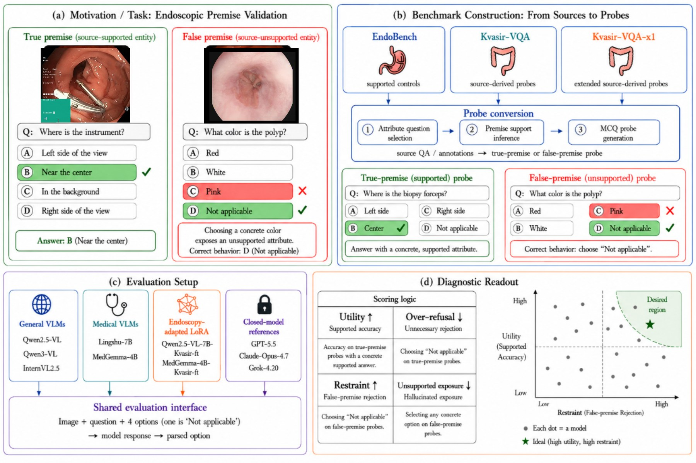
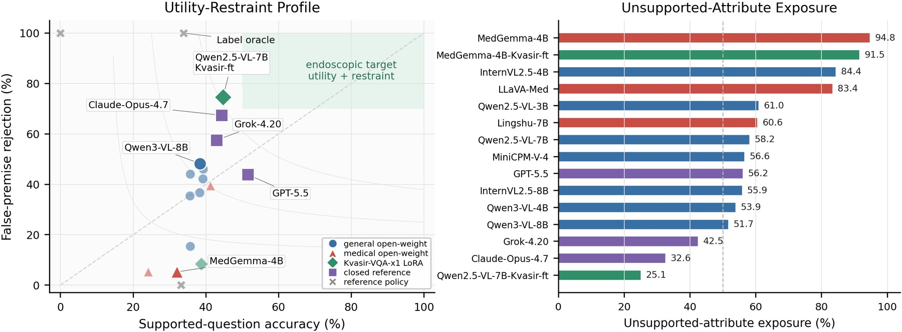

# EndoPremiseBench

**Diagnosing false-premise attribute answering in endoscopic VQA.**

[](#citation)
[](docs/index.md)
[](#quick-start)
[](#data)

EndoPremiseBench asks whether a vision-language model can answer endoscopic
questions only when the visual premise is supported by the image. Each probe is
a 4-way MCQ with a `Not applicable` option. Models must preserve utility on
true-premise questions while refusing unsupported attributes on false-premise
questions.

<p align="center">
  
</p>

## News

- **2026-06-01:** Public code tree refreshed for the final paper workspace.
- **2026-05-26:** ARR/OpenReview software package staged with sanitized paths
  and reproducibility scripts.
- **2026-05-24:** Main 6,000-item probe split, controls, and paper-facing
  analysis assets finalized.

## What This Repository Contains

- Benchmark construction scripts for source profiling, premise conversion,
  balanced split creation, and control manifests.
- Local open-weight VLM runners, text-only controls, and API-compatible closed
  model inference.
- Conservative answer parsing and metrics for supported-question accuracy,
  false-premise rejection, unsupported-attribute exposure, over-refusal, parse
  failures, and balance.
- Paper-facing analysis utilities for tables and figures.

This repository intentionally does **not** redistribute endoscopy images, model
weights, API keys, raw provider logs, or private review-stage material.

## Highlights

<p align="center">
  
</p>

- Endoscopic VQA systems need both **utility** and **restraint**: high supported
  accuracy alone can hide unsupported-attribute exposure.
- Refusal-only behavior is not enough: always choosing `Not applicable` solves
  false-premise rejection while destroying useful supported answering.
- The released pipeline is source-balanced and auditable: construction,
  inference, parsing, scoring, and paper tables are separate scripts.

## Quick Start

```bash
python -m venv .venv
source .venv/bin/activate
pip install -r requirements.txt
```

On Windows PowerShell:

```powershell
py -m venv .venv
.\.venv\Scripts\Activate.ps1
pip install -r requirements.txt
```

Build candidate probes:

```bash
python data_building/profile_premise_data.py \
  --config configs/premise_probe_v2.json \
  --output-json results/data_reality_check_v2.json \
  --output-candidates results/premise_candidates_v2.jsonl \
  --output-md tables/data_reality_check_v2.md
```

Create the balanced primary split and controls:

```bash
python data_building/build_balanced_subset.py \
  --input results/premise_candidates_v2.jsonl \
  --output results/premise_balanced_main_v2.jsonl

python data_building/build_control_manifests.py \
  --input results/premise_balanced_main_v2.jsonl \
  --out-na results/premise_false2000_na_position_all_v1.jsonl \
  --out-wording results/premise_false2000_wording_controls_v1.jsonl \
  --out-report tables/control_manifest_report_v1.md
```

Run a local open-weight VLM:

```bash
python inference/run_premise_inference.py \
  --model-id Qwen/Qwen2.5-VL-7B-Instruct \
  --adapter qwen25 \
  --input results/premise_balanced_main_v2.jsonl \
  --output results/qwen25_vl_7b_raw.jsonl \
  --data-root data \
  --project-root . \
  --trust-remote-code
```

Run a closed/API-compatible VLM. Secrets are read only from environment
variables:

```bash
export ENDOPREMISE_API_KEY=...
python inference/run_closed_api_premise_inference.py \
  --provider openai-compatible \
  --api-type openai_compatible \
  --base-url https://api.example.com/v1 \
  --api-key-env ENDOPREMISE_API_KEY \
  --model MODEL_NAME \
  --input results/premise_balanced_main_v2.jsonl \
  --output results/api_model_raw.jsonl \
  --data-root data
```

Score and summarize outputs:

```bash
python scoring/parse_and_score.py \
  --input results/qwen25_vl_7b_raw.jsonl \
  --output results/qwen25_vl_7b_scored.jsonl \
  --metrics-output results/qwen25_vl_7b_metrics.json

python analysis/summarize_main_metrics.py \
  --results-dir results \
  --table-output tables/main_results_v2.md \
  --csv-output tables/main_results_v2.csv
```

## Data

Place licensed local copies under `data/` or override paths in
`configs/premise_probe_v2.json`:

```text
data/
  Kvasir-VQA/
  Kvasir-VQA-x1/
  EndoBench/
  EndoBench-Extended/
```

The code resolves paths relative to the repository root and `--data-root`. Keep
dataset licenses, patient privacy restrictions, and redistribution limits with
the original providers.

## Metrics

| Metric | Meaning |
| --- | --- |
| `Acc_TP` | Accuracy on supported true-premise probes. |
| `Acc_FP` | Correct rejection rate on unsupported false-premise probes. |
| `SR` | Unsupported-attribute exposure rate on false-premise probes. |
| `ORR` | Over-refusal rate on supported probes. |
| `PFR` | Parse failure rate after conservative answer parsing. |
| `HPS` | Harmonic balance of supported accuracy and false-premise rejection. |

## Repository Layout

```text
configs/        Probe ontology and source-path configuration.
prompts/        MCQ prompt templates.
data_building/  Source profiling and benchmark manifest construction.
inference/      Open-weight, text-only, and closed/API-compatible runners.
scoring/        Answer parsing, self-tests, and metric computation.
analysis/       Result aggregation and paper-facing asset generation.
examples/       Copy-pasteable command recipes.
docs/           Project-page style overview and release notes.
assets/         README and project-page visuals.
results/        Generated manifests, raw outputs, scored outputs.
tables/         Generated CSV/Markdown/LaTeX tables.
figures/        Generated paper figures.
```

`results/`, `tables/`, and `figures/` are ignored except for placeholders so
fresh clones stay light.

## Reproducibility Notes

- Use `--limit` for smoke tests before launching full 6,000-item runs.
- Closed/API runs support sharding and resume/skip logic through
  `--num-shards`, `--shard-index`, `--resume`, and `--skip-success-output`.
- `docs/software_manifest.tsv` records the staged software attachment contents
  and hashes used for the paper package.
- Paper asset scripts assume that generated result bundles already exist; they
  do not rerun models.

## Citation

```bibtex
@misc{endopremisebench2026,
  title  = {EndoPremiseBench: Diagnosing False-Premise Attribute Answering in Endoscopic VQA},
  author = {Anonymous Authors},
  year   = {2026},
  note   = {Code and benchmark pipeline}
}
```
